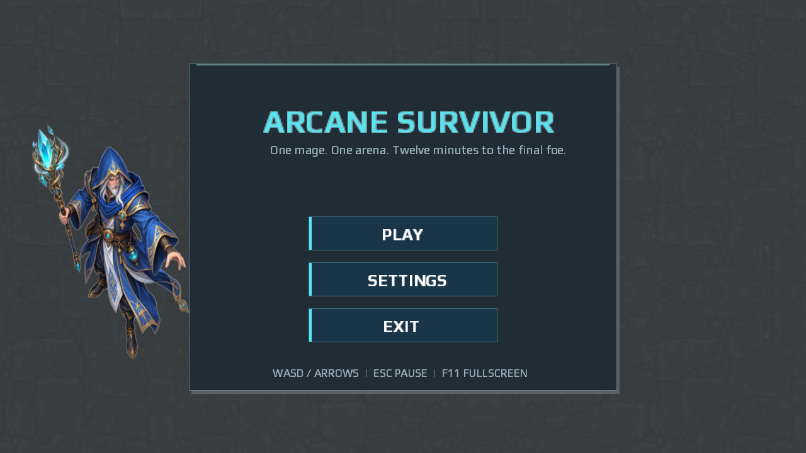
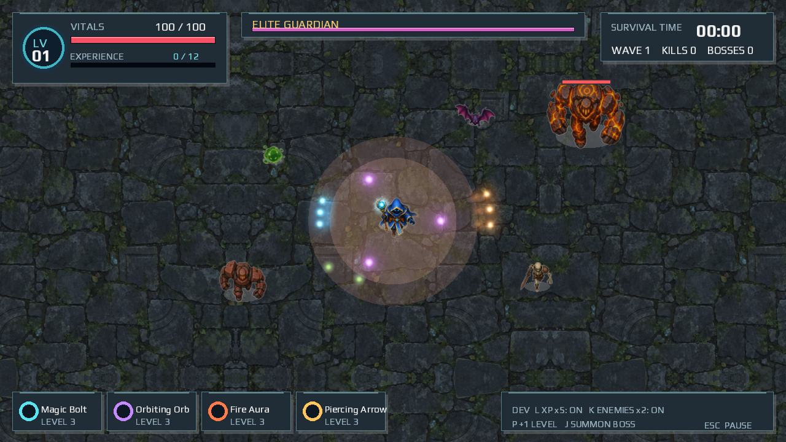
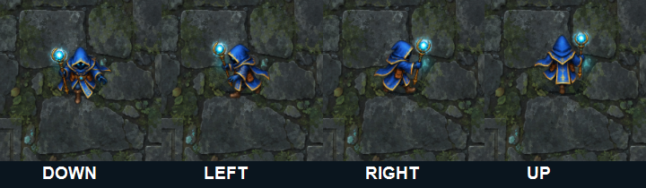

# Arcane Survivor

Arcane Survivor é um roguelite local de sobrevivência em 2D, feito com Java e LibGDX. Atravesse uma arena em ruínas, derrote inimigos com armas automáticas, colete experiência e escolha melhorias. Sobreviva até o chefe final aparecer aos 12:00 e derrote-o para vencer.

## Recursos

- Movimentação fluida e independente da taxa de quadros, com câmera que acompanha o jogador e animações de repouso e caminhada em quatro direções
- Animações de movimento dos inimigos: compressão da slime, asas do morcego, marcha do esqueleto, balanço do golem e chefe flutuante
- Ataques automáticos com quatro armas: Magic Bolt, Orbiting Orb, Fire Aura e Piercing Arrow. Cada nível de arma adiciona um projétil, flecha ou orbe; a Fire Aura aumenta o alcance.
- Quatro tipos de inimigos comuns, ondas periódicas e surgimento progressivo de inimigos, um mini-chefe aos 6:00 e o chefe final aos 12:00
- Gemas de experiência, níveis, três opções aleatórias de melhoria e armas até o nível cinco
- Vida, armadura, breve invulnerabilidade, HUD, pausa, fim de jogo, vitória e estatísticas da partida
- Menus por teclado e mouse, configurações de volume e tela cheia opcional
- Sprites ilustrados originais, piso de ruínas discreto e luz emitida pelos projéteis do jogador
- Atalhos de desenvolvimento para ganhar experiência mais rápido, aumentar o surgimento de inimigos e testar imediatamente o chefe final

## Requisitos

- JDK 21 or newer
- Apache Maven 3.9 or newer

## Como executar

No diretório do projeto:

```bash
mvn test
mvn exec:java
```

No Windows PowerShell, use os mesmos comandos. Se o Maven usar uma instalação mais antiga do Java, defina `JAVA_HOME` apontando para o diretório do JDK 21 ou superior:

```powershell
$env:JAVA_HOME = 'C:\path\to\jdk-21'
mvn test
mvn exec:java
```

Na primeira compilação, o Maven baixa o LibGDX e o JUnit do Maven Central.

## Controles

| Tecla | Ação |
| --- | --- |
| WASD / setas direcionais | Mover |
| Esc | Pausar / continuar |
| 1, 2, 3 | Escolher uma melhoria |
| Mouse | Usar menus e escolher melhorias |
| F11 | Alternar tela cheia |
| L | Alternar para 5x a experiência das gemas coletadas durante a partida |
| K | Alternar para 2x o surgimento de inimigos comuns durante a partida |
| J | Invocar imediatamente o chefe final, uma vez por partida |
| P | Ganhar um nível de personagem imediatamente e escolher uma melhoria |

## Arquitetura

- `model`: jogador, inimigos, projéteis e gemas de experiência, com regras independentes da renderização
- `weapon`: comportamentos individuais de armas automáticas por trás de uma pequena classe base comum
- `system`: simulação da partida, surgimento de inimigos, progressão de dificuldade e seleção de melhorias
- `screen`: renderização do LibGDX, HUD, estados de menu e entrada do jogador
- `ArtAssets`: texturas ilustradas, regiões de sprites, piso repetível e textura reutilizável de brilho
- `Facing`: estado compartilhado das quatro direções usado pelo jogador e pelos inimigos; o tempo de animação avança com a simulação
- `AudioManager`: música local e efeitos sonoros opcionais; arquivos ausentes ficam em silêncio

O ciclo de renderização atualiza a simulação somente durante a partida ativa. Menu, pausa e seleção de melhorias interrompem o cronômetro e o combate. As colisões usam círculos. O mundo tem uma arena finita, e o número de inimigos ativos é limitado a 320.

## Capturas de tela

### Menu principal



### Prévia do HUD e da arte



Esta prévia usa uma cena de validação preparada para mostrar os sprites dos inimigos juntos. Em uma partida normal, os tipos de inimigo são desbloqueados com o tempo.

### Direções do jogador



A prévia mostra um quadro de caminhada para cada direção. O jogo alterna os quadros de caminhada restantes durante o movimento e reproduz uma animação sutil de respiração em repouso.

## Recursos visuais e sonoros

| Recurso | Autor / fonte | Licença / status |
| --- | --- | --- |
| Piso de ruínas, atlas de personagens, folha direcional do mago, Necromancer e retrato do mago | Criados para este projeto com o `image_gen` integrado da OpenAI; prompts em [ART_PROMPTS.md](ART_PROMPTS.md) | Arte gerada para o projeto; sem recurso de terceiros |
| Fontes Play Regular e Bold | Jonas Hecksher, Playtypes, e-types AS; [Google Fonts](https://github.com/google/fonts/tree/main/ofl/play) | SIL Open Font License 1.1; texto da licença em `src/main/resources/font/OFL.txt` |
| Textura de brilho | Gerada em tempo de execução por `ArtAssets` | Código original do projeto |

Áudios opcionais podem ser colocados em `src/main/resources/audio/` como `music.ogg`, `attack.wav`, `kill.wav`, `level.wav`, `hurt.wav` e `boss.wav`. Registre o nome, autor, fonte e licença de qualquer áudio adicionado ao projeto.

## Melhorias futuras

Novos personagens e armas, mapas alternativos, evoluções de armas, conquistas, mais chefes, salvamentos locais, placar de líderes e modos de dificuldade.
